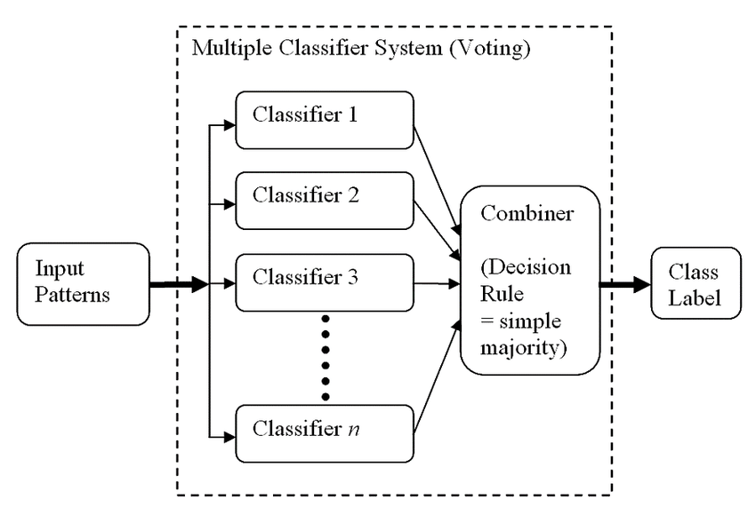

# Ensemble Voting (Grid Search CV) 

@@FUN STUFF

### Pre-processing:
Step 1: Loaded the training dataset into a pandas data frame.  
Step 2: Removed redundant features 
Step 3: Calculated the percentage of the missing values per features. 
Step 4: Eliminated the features with very high ratio of missing values. 
Step 5. Constructed imputation processes by most frequent for handling the remaining features with missing values. 
Step 6: Built a procedure to properly incorporate the text based feature; 
&nbsp;&nbsp;&nbsp;&nbsp;&nbsp;&nbsp;&nbsp; a) Take out the variable. 
&nbsp;&nbsp;&nbsp;&nbsp;&nbsp;&nbsp;&nbsp; b) Get all the unique codes across all the samples. 
&nbsp;&nbsp;&nbsp;&nbsp;&nbsp;&nbsp;&nbsp; c) Made a data frame with columns corresponding to (b) above. 
&nbsp;&nbsp;&nbsp;&nbsp;&nbsp;&nbsp;&nbsp; d) Went through the samples, split the codes, and flagged the columns corresponding to the codes in (c) above. 
&nbsp;&nbsp;&nbsp;&nbsp;&nbsp;&nbsp;&nbsp; e) These resulted in a data frame with the columns as unique codes. And there values are 1 or 0 signifying the presence of the code or not respectively. 
Step 7: Concatenated the processed feature data with the remaining data set. 
Step 8: Initiated One-Hot encoding for the categorical variables (ignored ordering). 
Step 9: Implemented [0, 1] normalization 
Step 10: Initiated PCA with about 99% variance explained, however it didn’t perform well on the models. Hence, it was dropped. 

### Modeling:
Step 1: Split the preprocessed training data into train set and test set. 
Step 2: Picked 10 for k-fold cross validation (This can be an environment variable). 
Step 3: Set metric evaluation to roc-auc (This can be an environment variable). 

Step 4: Constructed a data frame to house the performance of each models. 
Step 5: Implemented grid search cross validation for the models that requires picking optimal hyper-parameters. 
Step 5: Models 
&nbsp;&nbsp;&nbsp;&nbsp;&nbsp;&nbsp;&nbsp; a) Naive Bayes 
&nbsp;&nbsp;&nbsp;&nbsp;&nbsp;&nbsp;&nbsp; b) KNN 
&nbsp;&nbsp;&nbsp;&nbsp;&nbsp;&nbsp;&nbsp; c) Logistic Regression – Ridge 
&nbsp;&nbsp;&nbsp;&nbsp;&nbsp;&nbsp;&nbsp; d) SVM - RBF Kernel 
&nbsp;&nbsp;&nbsp;&nbsp;&nbsp;&nbsp;&nbsp; e) Multi-layer Perceptron (MLP) 
Step 6: Built an ensemble method by voting for combining all the models.
